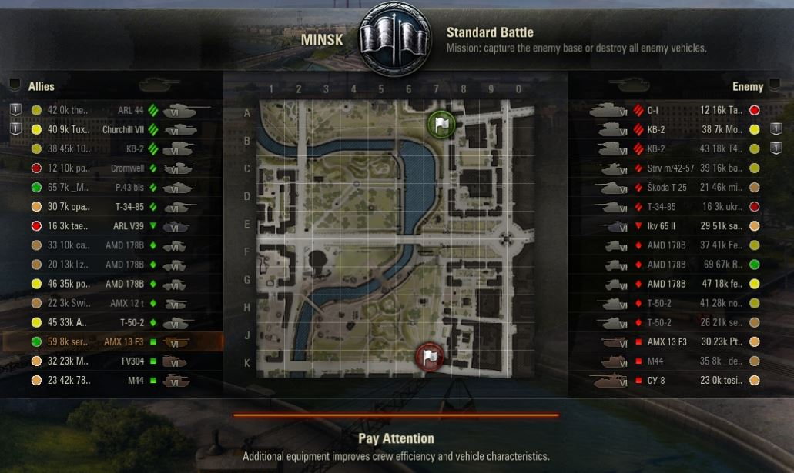
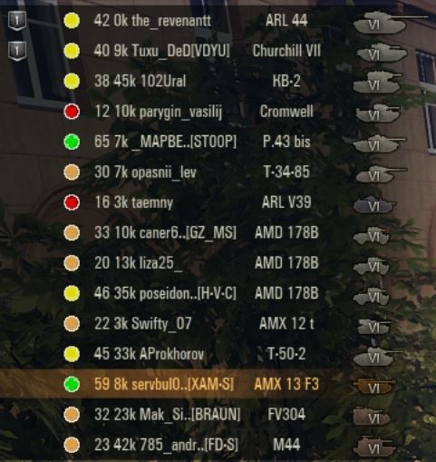
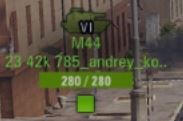

# Русский [read in English](#English)

# The Recent Stat of You
Мод с открытым исходным кодом для отображения недавней статистики игроков в бою.

## Суть
Главное отличие этого мода от аналогичных &mdash; это возможность отображения обещающего быть более информативным **недавнего** рейтинга эффективности (примерно за последнюю тысячу боев, то есть примерно за последние 50 часов игрового времени). В остальном это всe тот же мод, который Вы видели у *XVM*, *PolarFox* и *Ekspoint*.

Мод позволяет отображать недавнюю статистику игроков в следующих местах:
- В окне загрузки боя.
- В ушах.
- В маркерах над техникой.
- В таблице игроков при нажатии Tab.

## Как это выглядит
На данный момент показ статистики достигается переименованием игроков: к имени добавляется префикс. Префикс настраивается в файле конфигурации.

Также присутствует возможность заменять нашивки.

### Окно загрузки
Аналогично таблице игроков при нажатии Tab.

### Уши

### Маркеры

## Как это работает
Мод обращается к провайдерам недавней статистики, и если она находится, выводит ее заместо общей статистики.

Данные берутся с сайтов [kttc.ru](https://kttc.ru/) (разрешение на использование от представителя сайта получено) и [noobmeter.com](https://noobmeter.com/) (связаться с представителем сайта не удалось, поэтому пока считаем, что запрета на использование сайта нет).

## Внести вклад
Открытие Pull Request'ов, решающих как планируемые задачи, так и любые другие, приветствуется. Любые идеи по развитию также с радостью будут услышаны, Вы можете оставить свои вопросы и предложения во вкладке "[Issues](https://github.com/SerVB/TheRecentStatOfYou/issues)".

В ближайшее время я улучшать мод не планирую, ведь у меня есть другие проекты. Сам использую мод в текущем состоянии, и это меня устраивает.

## Далекие планы
во вкладке "[Issues](https://github.com/SerVB/TheRecentStatOfYou/issues)".

## Скачивание
во вкладке "[Releases](https://github.com/SerVB/TheRecentStatOfYou/releases)".

## Установка
Положите файлы `.wotmod` в папку `mods/{версия_игры}/`. Для смены стандартных настроек мода скачайте папку `configs` и положите ее в папку `mods/`.

## Построение из исходников
Запустите файл `build.py`, мод соберется в папке `build/`.

Для сборки мода иконок запустите `badgesModifier/battleBadgesModifier.py`, сохраните полученный в папке `target` файл `PNG` как файл `DDS`, запустите `badgesModifier/build.py`, мод иконок соберется в папке `badgesModifier/build/`.

## Известные проблемы
- При начале загрузки боя происходит подвисание от трех до десяти секунд, связанное со скачиванием данных с сайта. Запросы происходят многопоточно, асинхронно и одновременно, поэтому тут вряд ли можно что-то улучшить. Даже если найдется способ получать статистику всех игроков в бою за один запрос, он будет проходить за то же время...
- Клиент иногда пишет в лог, что не может найти ник игрока и поэтому использует более медленный вариант поиска. Наверное, это связано с тем, что мод фактически переименовывает игроков. Пока видимых симптомов в клиенте игры не замечено. Но с обновлением клиента это может стать причиной вылетов, если не полной неработоспособности...

## FAQ
**Q**. Новая версия Танков, а мод не адаптирован. Автор признаков жизни не подает. Моду конец?  
**A**. Посмотрите файлы, изменяемые модом, в файле `mod_recent_stat_init.py`. Найдите те же файлы в репозитории декомпилированных файлов танкового клиента [WorldOfTanks-Decompiled](https://github.com/StranikS-Scan/WorldOfTanks-Decompiled/). Если они не менялись с новым патчем, то мод скорее всего будет работать в новой версии, необходимо только переложить его в папку с номером новой версии (по крайней мере, при обновлении с 1.1 на 1.2 код мода модифицировать не пришлось).

**Q**. На каком кластере работает мод?  
**A**. Мод должен работать на любых кластерах. Попробуйте поменять регион в конфиге `config_main.json`.

**Q**. Как поменять провайдера недавней статистики или полностью отключить возможность показа недавней статы?  
**A**. В конфиге `config_main.json`.

## Благодарности
[ATTRIBUTIONS.MD](ATTRIBUTIONS.MD).

# English

# The Recent Stat of You
An open-source mod displaying players' recent statistics in battle.

## Idea
The main difference of this mod from similar is the ability to display more informative **recent** efficiency rating (approximately of the last thousand battles, that is, of the last 50 hours of playing time). Otherwise, this is the same mod that you saw from *XVM*, *PolarFox* and *Ekspoint*.

The mod allows to display statistics in the following places:
- On the battle loading screen.
- On the battle players panel.
- In markers.
- On the Tab players panel.

## How does it look like?
Currently, statistics are displayed using players renaming: a prefix is added to the name. The prefix can be configured in the configuration file.

Also, there is an opportunity to modify badges.

### Battle loading screen
Equal to the Tab players panel.

### Battle players panel

### Markers

## How does it work?
Mod asks the providers of recent statistics, and if there is an answer, displays recent stats instead of overall statistics.

Data is taken from [kttc.ru](https://kttc.ru/) (permission is granted) и [noobmeter.com](https://noobmeter.com/) (I couldn't contact the site developers so I assume there is no prohibition to use the site).

## Contribute
Pull request opening to resolve planning tasks or any other tasks is appreciated. Any ideas on development will also be happy to be heard, you can leave your questions and suggestions in the "[Issues](https://github.com/SerVB/TheRecentStatOfYou/issues)" tab.

In the near future, I do not plan to improve the mod, because I have other projects. I myself use the mod in the current state, and it suits me.

## Planing tasks
are located in the "[Issues](https://github.com/SerVB/TheRecentStatOfYou/issues)" tab.

## Downloads
are located in the "[Releases](https://github.com/SerVB/TheRecentStatOfYou/releases)" tab.

## Installation
Place the `.wotmod` files into `mods/{game_version}/`. To change default mod settings, download the dir `configs` and place it into `mods/`.

## Build from sources
Run the `build.py` file, the mod will be built in the `build/` dir.

To build badges modification, run the `badgesModifier/battleBadgesModifier.py` file, save the `PNG` file from `target` dir as a `DDS` file, run the `badgesModifier/build.py` file, the badges modification will be built in the `badgesModifier/build/` dir.

## Known issues
- At a battle loading start there is a lag of 3-10 seconds. It's because of data downloading from the Internet. Downloading happens in multiple threads, asynchronously and simultaneously so I think there is nothing to improve. It's the time of a single query completion.
- Sometimes there are messages in the log like "can't find player name, use slow search". Maybe it's because the mod just renames players. There is no symptoms have been noticed. Anyway, in future game versions it can became a problem...

## FAQ
**Q**. The mod isn't adopted for a new World of Tanks version.
**A**. Check `mod_recent_stat_init.py` for the list of modified files. Find the same files in game decompiled sources [WorldOfTanks-Decompiled](https://github.com/StranikS-Scan/WorldOfTanks-Decompiled/). If they haven't been changed, it's likely the mod will work. It's only needed to put the mod in the new dir. For example, the mod was working after update from 1.1 to 1.2.

**Q**. Which clusters are supported?  
**A**. All clusters should be supported. Try to change it in `config_main.json`.

**Q**. How to change providers of recent stat or completely disable the recent stat feature?  
**A**. In `config_main.json`.

## Attributions
[ATTRIBUTIONS.MD](ATTRIBUTIONS.MD).
